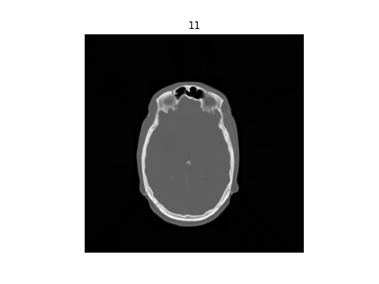
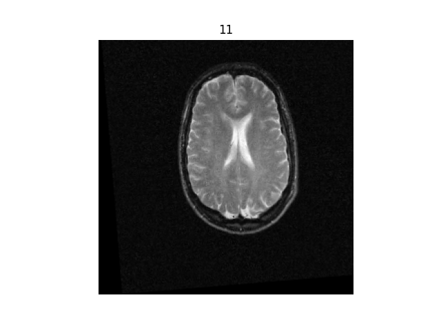
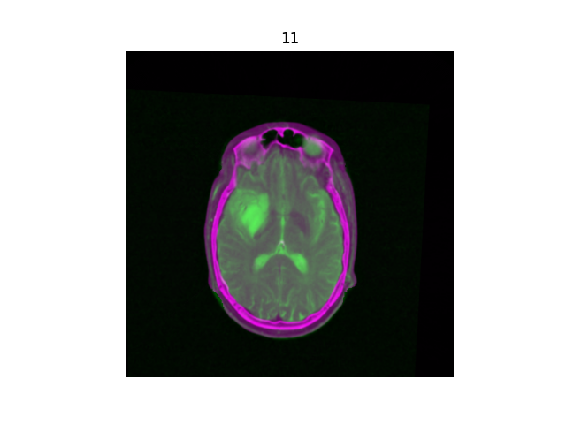

# Image registration 

## Intro
The purpose of the project is to perform a multimodal intrasubject 3D to 3D image registration. SimpleITK was used for the implementation.
The images are from the dataset https://rire.insight-journal.org/ . There are both CT, PET and MRI, and they belong to the same patient.

The registration is rigid; the metric used is mutual information, the interpolation is linear, and the optimizer is a gradient descent.

The final result can be visualized using various color combinations.

## How to run

Before running make sure to have locally:
- Python 3.8.6
- Git any
- Pip any

Run:
- `$ git clone https://github.com/MartinaCasag/registration.git`
- `$ cd registration`
- `$ python -m pip install matplotlib SimpleITK`
- `$ python src/image_registration.py`

## Results
### CT

### MRI

### Registration

